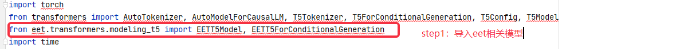
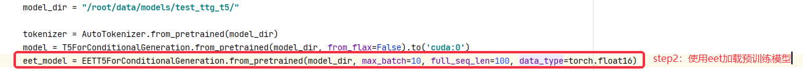
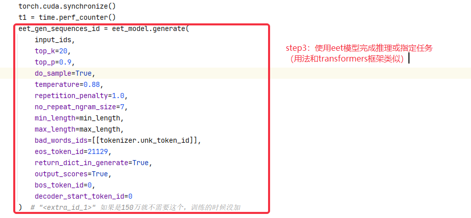

## EET T5模型使用

## 快速开始

### 环境

* cuda:>=10.1 
* python:>=3.7 
* gcc:>= 7.4.0 
* torch:>=1.5.0 
* numpy:>=1.19.1 
* fairseq
* transformers

上述环境是最低配置，最好是使用较新的版本。


### 安装EET

#### 源码安装
如果从源代码安装，则需要安装必要的[environment](#environment)。然后，按以下步骤进行。 
```bash
$ git clone https://github.com/NetEase-FuXi/EET.git
$ pip install .
```


### 运行

使用eet加速t5模型，可参考./example/python/models/t5_transformers_example.py

使用eet加速t5模型完成文本生成任务，参考./test.py

使用说明：






